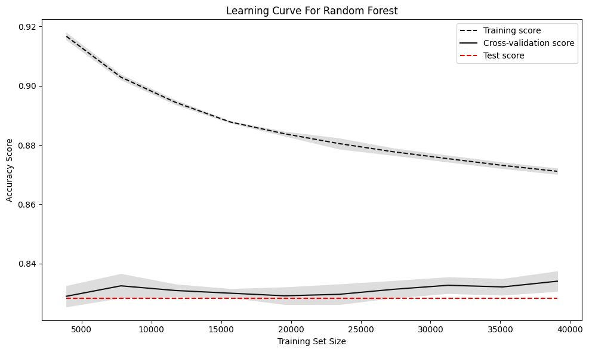
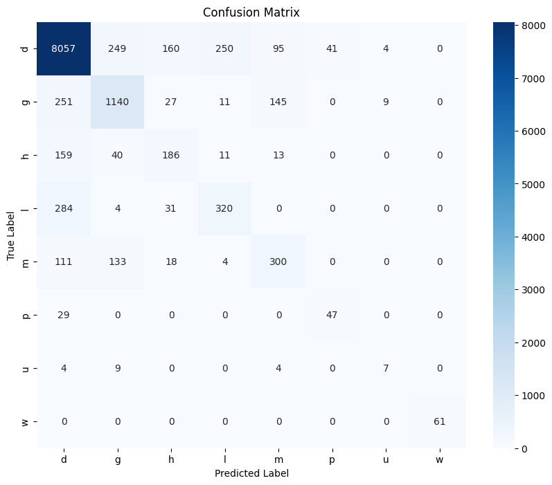
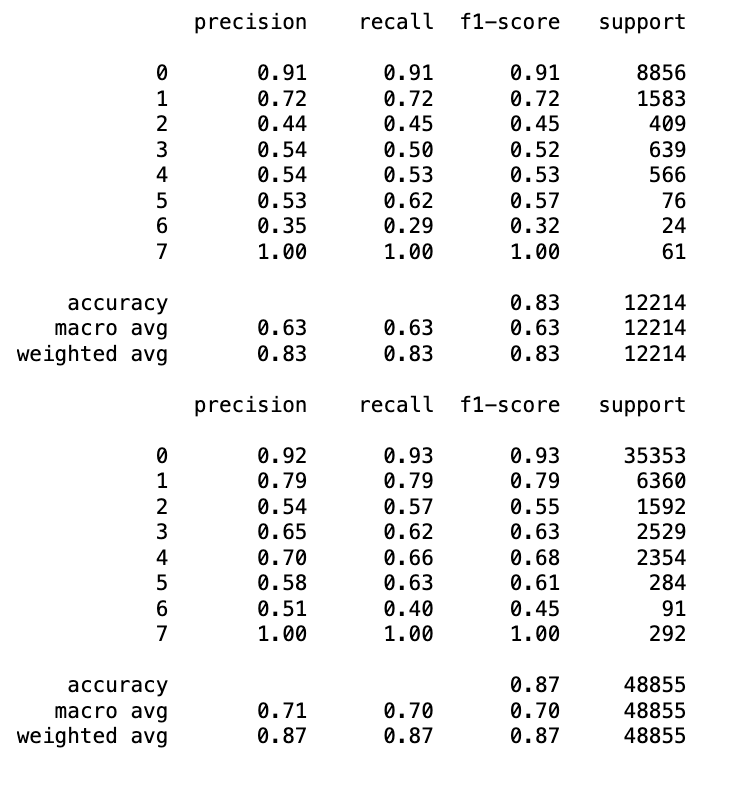

# CSE151A Mushroom Analysis Project 
### Introduction 
The choice to focus on mushroom analysis in this project stems from a blend of biology, data science, and biodiversity conservation. Mushrooms, with their diverse species, some edible and others potentially lethal, present a unique challenge in terms of classification and identification. The ability to accurately predict whether a mushroom is edible or poisonous through machine learning models not only has direct implications for food safety but also contributes to the broader field of biological classification and environmental science.

The significance of this project extends beyond the immediate practicality of mushroom classification. Within it lies its ability to demonstrate how data and computer science can be applied to solve real-world problems in fields outside of traditional technology sectors. By leveraging the vast biodiversity of mushrooms and the detailed data available on their physical characteristics, this project showcases the power of machine learning in enhancing our understanding of the natural world. A predictive model with high accuracy can significantly reduce the risk of mushroom poisoning incidents, which annually affect thousands of people worldwide, sometimes with fatal outcomes.

The broader impact of developing a reliable predictive model for mushroom classification extends beyond immediate public health concerns. It contributes to the fields of mycology and ecology by providing insights into mushroom distribution, diversity, and characteristics. This knowledge can aid in conservation efforts, help monitor ecological changes, and even support the discovery of new mushroom species or medicinal compounds.

In essence, this project is not only intriguing because of its application of advanced data analytics to an unconventional and challenging dataset but also because it stands at the convergence of technology and nature. It underscores the potential of machine learning to contribute significantly to various scientific domains, highlighting the importance of interdisciplinary research and the vast possibilities that open up when different fields of study collaborate. Through this mushroom analysis project, we aim to advance our understanding of the natural world, improve public health safety, and demonstrate the far-reaching applications of computer science.

### Figures


### Methods
##### Data Exploration 
Our initial approach involved performing exploratory data analysis (EDA) on the mushroom datasets to gain insights into the distinguishing characteristics that could help distinguish a mushroom's habitat and edibility. These datasets have the potential to reveal discriminative features critical for distinguishing digestibility. Through careful data preprocessing—including cleaning, normalizing, and feature extraction—we aim to move closer to accurately distinguishing between edible and poisonous mushrooms.
[View the EDA Notebook](https://github.com/arnavkamra14/CSE151A_MushroomAnalysis/blob/RandomForest/Mushroom_Classification_CSE151A.ipynb)
```
df = pd.read_csv('secondary_data.csv',sep=';', on_bad_lines='skip')
df.head()
df.columns
Index(['class', 'cap-diameter', 'cap-shape', 'cap-surface', 'cap-color',
       'does-bruise-or-bleed', 'gill-attachment', 'gill-spacing', 'gill-color',
       'stem-height', 'stem-width', 'stem-root', 'stem-surface', 'stem-color',
       'veil-type', 'veil-color', 'has-ring', 'ring-type', 'spore-print-color',
       'habitat', 'season'],
      dtype='object')
# Keep naming consistent
df = df.rename(columns={"Cap-surface": "cap-surface"})
```
##### Preprocessing 
The preprocessing phase was crucial for preparing the data for modeling. This phase involved several steps: handling missing values, data cleaning, feature importance and selection, data balancing, visualization of distributions, and correlation analysis. 


``` df = pd.read_csv('secondary_data.csv',sep=';', on_bad_lines='skip')
df.head()
# Keep naming consistent
df = df.rename(columns={"Cap-surface": "cap-surface"})
# Because of multicolinearity and name has no correlation
df = df.drop(columns=['spore-print-color',
                     'has-ring'])

#Binary Encoding
binary_mapping = {'[t]': 1, '[f]': 0}
df['does-bruise-or-bleed'] = df['does-bruise-or-bleed'].map(binary_mapping)
binary_mapping = {'p': 1, 'e': 0}
df['class'] = df['class'].map(binary_mapping)

# Too many Nan values where imputation is not good to do
df = df.drop(columns=['stem-root', 'stem-surface', 'veil-type', 'veil-color'])
df['gill-attachment'].fillna('[?]', inplace=True)
df['ring-type'].fillna('[?]', inplace=True)
df['cap-surface'].fillna('[?]', inplace=True)
df['gill-spacing'].fillna('[?]', inplace=True)
# As per the ? key used, we simply filled in the Nans as they are essentially unknown

columns_to_apply_multilabeling = ['cap-shape','cap-surface','cap-color','gill-attachment', 'gill-spacing', 'gill-color','stem-color','ring-type','season']

for col in columns_to_apply_multilabeling:
    mlb = MultiLabelBinarizer()
    column = df[col].apply(lambda x: x.strip('[]').split(', '))
    
    encoded_data = mlb.fit_transform(column)
    encoded_df = pd.DataFrame(encoded_data, columns=mlb.classes_+"_"+col)
    df = df.drop(col, axis=1)
    df = pd.concat([df, encoded_df], axis=1)

#Feature Selection using Chi-Squared Test and SelectKBest
selector = SelectKBest(score_func=chi2, k=10)  # Specify the desired number of features
X_selected = selector.fit_transform(X, y)
selected_feature_indices = selector.get_support(indices=True)
selected_feature_names = X.columns[selected_feature_indices]
X_selected_df = pd.DataFrame(X_selected, columns=selected_feature_names)

#Encoding y
mlb = MultiLabelBinarizer()
y_transformed = mlb.fit_transform(y)

#Feature importance Using RandomForests
rf_classifier = RandomForestClassifier()
rf_classifier.fit(X, y)
feature_importances = rf_classifier.feature_importances_
feature_importances_with_names = list(zip(X.columns, feature_importances))
for name, importance in feature_importances_with_names:
    print(f"Feature: {name}, Importance: {importance}")


from imblearn.over_sampling import SMOTE
oversample = SMOTE()
X, y = vis_df.iloc[:, :-1], vis_df.iloc[:, -1]
X, y = oversample.fit_resample(X, y)

import ast


vis_df_copy = vis_df.copy()

numeric_columns = vis_df_copy.select_dtypes(include=[np.number]).columns
correlation_matrix = vis_df_copy[numeric_columns].corr()

print(vis_df_copy.head())

plt.figure(figsize=(10, 8))
sns.heatmap(correlation_matrix, annot=True, cmap='coolwarm')
plt.title('Feature Correlation Matrix')
plt.show()
```

----------------------------------------------------------------------------------------
##### Model 1
Our first model was a logistic regression classifier, chosen for its simplicity and effectiveness in binary classification tasks. We evaluated the parameters of set size, regularization, and cross-validation. 

```
from sklearn.preprocessing import LabelEncoder


encoder = LabelEncoder()
y_encoded = encoder.fit_transform(vis_df['habitat'])

selector = SelectKBest(score_func=chi2, k=9)  
X_selected = selector.fit_transform(X, y)
selected_feature_indices = selector.get_support(indices=True)
selected_feature_names = X.columns[selected_feature_indices]
X_selected_df = pd.DataFrame(X_selected, columns=selected_feature_names)
X_train, X_temp, y_train, y_temp = train_test_split(X_selected_df, y_encoded, test_size=0.3, random_state=42)


X_val, X_test, y_val, y_test = train_test_split(X_temp, y_temp, test_size=1/3, random_state=42)
model = make_pipeline(StandardScaler(), LogisticRegression(multi_class='multinomial', solver='lbfgs', max_iter=1000))


model.fit(X_train, y_train)
y_train_pred = model.predict(X_train)
y_val_pred = model.predict(X_val)
y_test_pred = model.predict(X_test)


train_accuracy = accuracy_score(y_train, y_train_pred)
val_accuracy = accuracy_score(y_val, y_val_pred)
test_accuracy = accuracy_score(y_test, y_test_pred)

print(f"Training Accuracy: {train_accuracy}")
print(f"Validation Accuracy: {val_accuracy}")
print(f"Test Accuracy: {test_accuracy}")


print("Classification Report for Training Set:")
print(classification_report(y_train, y_train_pred, zero_division=0))

print("Classification Report for Validation Set:")
print(classification_report(y_val, y_val_pred, zero_division=0))

print("Classification Report for Test Set:")
print(classification_report(y_test, y_test_pred, zero_division=0))
```


----------------------------------------------------------------------------------------
##### Model 2
After assessing the performance of the logistic regression model, we explored K-Nearest Neighbors (KNN) for its simplicity and efficacy in classification based on feature similarity. As parameters, we considered the number of neighbors, distance metric, and weight function.

``` import warnings
warnings.filterwarnings("ignore", category=UserWarning)
warnings.filterwarnings("ignore", category=FutureWarning)
from sklearn.preprocessing import LabelEncoder
encoder = LabelEncoder()
y_encoded = encoder.fit_transform(vis_df['habitat'])
# Initial split: 70% training, 30% for temp (which will be split again into validation and test)
X_train, X_temp, y_train, y_temp = train_test_split(X_selected_df, y_encoded, test_size=0.3, random_state=42)

# Secondary split: Of the 30% temp, split into 2/3 for validation (20% of total) and 1/3 for test (10% of total)
X_val, X_test, y_val, y_test = train_test_split(X_temp, y_temp, test_size=1/3, random_state=42)
knn = KNeighborsClassifier(n_neighbors=5)
knn.fit(X_train, y_train)```

y_train_pred = knn.predict(X_train)
y_val_pred = knn.predict(X_val)
y_test_pred = knn.predict(X_test)


train_accuracy = accuracy_score(y_train, y_train_pred)
val_accuracy = accuracy_score(y_val, y_val_pred)
test_accuracy = accuracy_score(y_test, y_test_pred)
from sklearn.model_selection import GridSearchCV
param_grid = {'n_neighbors': [1, 3, 5, 7, 9]}  


knn = KNeighborsClassifier()
grid_search = GridSearchCV(estimator=knn, param_grid=param_grid, cv=5)
grid_search.fit(X_train, y_train)
best_params = grid_search.best_params_
print("Best Hyperparameters:", best_params)

best_knn = KNeighborsClassifier(n_neighbors=best_params['n_neighbors'])
best_knn.fit(X_train, y_train)

y_pred = best_knn.predict(X_test)

accuracy = accuracy_score(y_test, y_pred)
print("Test Accuracy with Best Model:", accuracy)
print("Classification Report for Test Set:")
print(classification_report(y_test, y_pred, zero_division=0)) 

```

----------------------------------------------------------------------------------------
##### Model 3
Our goal was to get a comprehensive analysis of mushroom data, aiming to distinguish between various habitats using a Random Forest classifier. The process began with preprocessing the data, where we applied Label Encoding to transform the categorical target variable 'habitat' into a numeric format. To refine our feature set and enhance model performance, we employed the SelectKBest method with the chi-square score function to identify the top 9 features most relevant to our target variable, thus reducing dimensionality and focusing our analysis on the most significant predictors. Following feature selection, we prepared our data for modeling by splitting it into training and testing sets, ensuring a distribution that allows for both effective learning and unbiased evaluation of the model's performance on unseen data. This split was crucial for validating our model's ability to generalize beyond the training dataset.

With our data prepared, we proceeded to the model training and employed the Random Forest algorithm due to its robustness and efficiency in handling complex datasets with interrelated features. To optimize the model, we conducted hyperparameter tuning through GridSearchCV, exploring a comprehensive grid of parameters including the number of trees in the forest (n_estimators), the maximum depth of these trees (max_depth), and the minimum number of samples required to split a node (min_samples_split) and to be at a leaf node (min_samples_leaf). This exhaustive search across the parameter space, coupled with cross-validation, was instrumental in identifying the optimal model configuration to maximize accuracy.
[Link to Random Forest Notebook](https://github.com/arnavkamra14/CSE151A_MushroomAnalysis/blob/RandomForest/RandomForest.ipynb)
``` from sklearn.model_selection import GridSearchCV
from sklearn.ensemble import RandomForestClassifier
from sklearn.model_selection import train_test_split


X_train, X_test, y_train, y_test = train_test_split(X, y_encoded, test_size=0.2, random_state=42)

param_grid = {
    'n_estimators': [100, 200, 300], 
    'max_depth': [None, 10, 20, 30],  
    'min_samples_split': [2, 5, 10],  
    'min_samples_leaf': [1, 2, 4]     
}

rf = RandomForestClassifier(random_state=42)
grid_search = GridSearchCV(estimator=rf, param_grid=param_grid, cv=5, n_jobs=-1, verbose=2, scoring='accuracy')
grid_search.fit(X_train, y_train)

# Print the best parameters and the best score
print(f"Best parameters found: {grid_search.best_params_}")
print(f"Best cross-validation score achieved: {grid_search.best_score_}")

# Use the best estimator to make predictions on the test set
best_estimator = grid_search.best_estimator_
y_pred = best_estimator.predict(X_test)

from sklearn.metrics import accuracy_score
print(f"Test set accuracy: {accuracy_score(y_test, y_pred)}")
# Generating learning curves
train_sizes, train_scores, validation_scores = learning_curve(
    estimator=model,
    X=X_train,  # Use the training part of data here
    y=y_train,  # Use the encoded target variable of the training part
    train_sizes=np.linspace(0.1, 1.0, 10),
    cv=5,  # 5-fold cross-validation
    scoring='accuracy',  # Using accuracy as the scoring parameter
    n_jobs=-1  # Use all available cores
)

# Calculate mean and standard deviation for training set scores
train_mean = np.mean(train_scores, axis=1)
train_std = np.std(train_scores, axis=1)

# Calculate mean and standard deviation for validation set scores
validation_mean = np.mean(validation_scores, axis=1)
validation_std = np.std(validation_scores, axis=1)

# Calculate test score using the entire test set (for plotting)
# Note: This uses the final model trained on the full training set, not the subsets used in learning_curve
test_score = accuracy_score(y_test, y_test_pred)

# Plotting learning curve
plt.subplots(1, figsize=(10,6))
plt.plot(train_sizes, train_mean, '--', color="#111111", label="Training score")
plt.plot(train_sizes, validation_mean, color="#111111", label="Cross-validation score")

# Add test score to the plot
plt.hlines(test_score, train_sizes[0], train_sizes[-1], colors='red', label='Test score', linestyles='dashed')

# Drawing bands for the standard deviation
plt.fill_between(train_sizes, train_mean - train_std, train_mean + train_std, color="#DDDDDD")
plt.fill_between(train_sizes, validation_mean - validation_std, validation_mean + validation_std, color="#DDDDDD")

# Creating the plot
plt.title("Learning Curve")
plt.xlabel("Training Set Size"), plt.ylabel("Accuracy Score"), plt.legend(loc="best")
plt.tight_layout()
plt.show()
```
### Results
##### Data Exploration
The primary dataset, with 173 observations across 23 features, including cap dimensions, colors, shape, surface, and more, reveals details about biodiversity. It does contain a number of null values which are concentrated in about five features. The secondary dataset provided a broader perspective with thousands of observations and included additional features such as stem dimensions, ring type, and cap shape, without any missing data. We performed introductory visual and statistical analysis and saw a few patterns emerge, such as the distribution of cap diameters and color variations. 
##### Preprocessing
We first removed instances with NaN values to ensure data integrity. Then we transformed our categorical features and output class using one-hot encoding to facilitate model processing. In addition to that, we utilized Chi-Squared tests and the SelectKBest library to identify the most significant features, reducing model complexity and focusing on relevant data. Our next step was to use Random Forests to determine the importance of various features. From this, we were able to determine the most significant features to impact the performance of the model and to reduce the overall dimensionality of the model. We created multiple distributions to determine how the classes are associated with the various features, such as seeing the distribution of the cap-shape values by the habitat of the various mushrooms. We also created a correlation matrix between the various features, to determine which of them are the most correlated and can affect each other.

We also implemented the Synthetic Minority Over-sampling Technique (SMOTE) to address imbalances in habitat distribution, particularly the overrepresentation of mushrooms found in woods(over 40,000), ensuring a uniform distribution across habitats. Oversampling resulted in a uniform distribution of the habitats in which the mushrooms were found. After oversampling, we analyzed cap-shape distributions across different habitats to understand feature-class relationships. The B-cap shape distribution, C-Cap shape distribution, and F-cap shape distribution can be seen above. There were vastly more mushrooms that had a stem width of 0 compared to a stem width of 1.

##### Model 1
Below is a learning graph that compares the accuracy scores of the training set, the test set, and the cross-validation set when using our first model as we increase the set size to 35000. The graph shows that the accuracy score of the training set, the cross-validation set, and the test set of our model are very close as we continue to increase the set size–in fact just thousandths away. This shows us that there isn't any overfitting. If there was overfitting, the scores would be wildly different. 


Here are the full classification reports for the training set, validation set, and test set on this model.


Below is a confusion matrix of the predicted habitat and the true habitat. Each of the letters corresponds to the following:
- w = waste
- u = urban
- p = paths
- m = meadows
- l = leaves
- h = heaths
- g = grasses
- d = woods


##### Model 2
We are happy with the results of our 2nd model, a K-nearest neighbors model using the 5 nearest neighbors. There was no overfitting, the accuracy score kept increasing with an increased training set size, and it did better than our first model. 

Below are the learning curve, confusion matrix, and classification report. 


From these visuals, we can tell that as we increase the training set size, the accuracy of both the training set and the cross-validation set increase, surpassing the test score. Overall, when compared to the first model, the accuracy increased amongst all sets. 

The hyperparameter tuning that we did involved using cross-validation with GridSearchCV to test the number of nearest neighbors that yield the highest accuracy. We used values [1,3,5,7,9] for the number of nearest neighbors, and we found that 9 yielded the highest accuracy of 0.74.

Something notable about the hyperparameter tuning is that it resulted in the accuracy scores of our logistic regression model decreasing (as seen below). However, our K-nearest neighbors model was still more accurate than our first model with the initial data used.


To improve upon this model, we can further test out different amounts of nearest neighbors and see what value is most optimal by comparing the performance of the model on our test data set after verifying its performance on our training data set.

When looking at our second model, we decided to continue with our original plan of using random forest classification to see if we could increase accuracy even further. This is because random forest classification tends to be more accurate than KNN because of its nature as an ensemble model and its generally accurate performance, relative to K-nearest neighbors. 


##### Model 3
The best parameter combination identified through GridSearchCV consisted of 300 trees in the forest, with no limitation on tree depth, and the minimum number of samples required to split a node and to be at a leaf node were kept at their default values of 2 and 1, respectively. This configuration achieved a best cross-validation score of approximately 94.51%.

Upon applying this tuned model to the test dataset, we observed a test set accuracy of approximately 94.86%. This affirms the model's robustness and its effectiveness in classifying mushroom habitats accurately. The precision, recall, and f1-score metrics, detailed in the classification report for both the test and training sets, revealed high performance across all habitat classes, with particularly impressive scores for the more common habitats. This high level of accuracy across the board demonstrates the model's comprehensive learning and its capacity to make precise predictions.

The confusion matrix visualization offered additional insights, presenting a clear depiction of the model's predictive successes and few misclassifications, providing a granular view of its performance across different habitats. Furthermore, the learning curve analysis illuminated the model's behavior with increasing training set sizes, showing a steady improvement in cross-validation scores, which plateaued as the model approached its learning capacity, indicating an effective learning process and the model's ability to generalize well.

The application of a Random Forest classifier, coupled with rigorous preprocessing, feature selection, and hyperparameter tuning, has proven to be highly effective in distinguishing mushroom habitats. The results not only highlight the model's accuracy and reliability but also its potential utility studies where such classification tasks are critical.


Below are the learning curve, confusion matrix, and classification report. 



As we can see, the cross-validation score is plateauing meaning that more data will not lead to better performance. The training score is decreasing as more data is being added which is evident of it being the adaption to fitting more data and predicting on itself. The wide gap between the cross-validation score and the training suggests some overfitting but the model gets better as generalizing as more data is added.



This is a confusion matrix of the predicted habitat and the true habitat. Each of the letters corresponds to the following:

- w = waste
- u = urban
- p = paths
- m = meadows
- l = leaves
- h = heaths
- g = grasses
- d = woods




The first classification report belongs to the test data set and the next belongs to the training. The reason for the exclusion of the validation dataset is the fact that we are used grid search.
From the reports we can see that we can be overfitting as the accuracy of the training report and higher than that of the test report's. To fix this overfitting perhaps we could've lowered the hyperparameter options max_depth to better generalize the data.


### Discussion
Discussion section: This is where you will discuss the why, and your interpretation and your though process from beginning to end. This will mimic the sections you have created in your methods section as well as new sections you feel you need to create. You can also discuss how believable your results are at each step. You can discuss any short comings. It's ok to criticize as this shows your intellectual merit, as to how you are thinking about things scientifically and how you are able to correctly scrutinize things and find short comings. In science we never really find the perfect solution, especially since we know something will probably come up int he future (i.e. donkeys) and mess everything up. If you do it's probably a unicorn or the data and model you chose are just perfect for each other!

EDA/Processing: 
Our initial dive into the datasets underscored the importance of thorough data exploration in understanding the nuances and complexities of the data. The presence of null values in significant features prompted us to adopt a meticulous approach to data cleaning and preprocessing. This phase involved decisions like handling missing values and applying one-hot encoding to categorical features, which directly impacted the subsequent model performance. The decision to use SelectKBest for feature selection, based on chi-square tests, was pivotal in reducing dimensionality and focusing on the features most relevant to our target variable. This step not only streamlined our modeling process but also provided early insights into which mushroom characteristics might be most influential in habitat classification. The preprocessing steps, particularly the use of SMOTE for addressing class imbalance, highlight the critical need to carefully balance data to reflect real-world distributions without biasing the model. This balance is delicate, as over-representation of certain habitats could skew model predictions, leading to overfitting or under-representation of less common habitats.
Model 1: 
take this out??? idk
The next two models we considered using on the data are random forest classification and k-nearest neighbors. We thought these were the best because random forest classification is likely to output an accurate prediction for classification problems because it uses multiple decision trees with various subsets of the dataset. The problem with random forest classification algorithms is that they tend to overfit to the training dataset, so we will need to be careful when training our model.  As for k-nearest neighbors, given that all of our habitat labels correspond to a specific group, it will be easy to use a clustering algorithm to classify the various mushrooms. Clustering tends to be a very versatile method for classification and k-nearest neighbors are an efficient clustering algorithm that we can test with various parameters. 
Model Selection and Implementation:
The transition from logistic regression to more complex models like K-Nearest Neighbors and Random Forest reflected an evolution in our approach to tackling the classification problem. The logistic regression model served as a baseline, providing a clear perspective on the data's behavior. Its relatively straightforward implementation allowed us to quickly assess the viability of our preprocessing efforts and set a benchmark for model performance.

The exploration of K-Nearest Neighbors introduced the challenges and opportunities of parameter tuning, especially the selection of the number of neighbors, which significantly influenced the model's accuracy and generalizability. This phase underscored the value of model diversity in our analysis, highlighting how different models could offer insights into the data.

Our eventual focus on the Random Forest model was a strategic choice driven by its performance and suitability for complex classification. The model's ability to handle complex, high-dimensional data and its intrinsic mechanisms for reducing overfitting made it an ideal candidate. The hyperparameter tuning phase- facilitated by GridSearchCV- was instrumental in refining the model to achieve optimal performance. This computationally intense process was crucial for navigating the trade-offs between model complexity, accuracy, and generalizability.

Evaluation and Results: 
The results from our models provided a great deal of information about the predictive power of the models themselves and the underlying patterns within the mushroom data. The accuracy, precision, recall, and f1-score metrics illuminated the strengths and weaknesses of each model across different habitat classes, offering a detailed view of their performance.

The learning curve analysis offered further insights into the models' behavior as the training set size increased, providing valuable clues about the models' learning efficiency and their potential for over or underfitting. This analysis was particularly revealing for the Random Forest model, where the relationship between the training and validation scores highlighted areas for potential improvement.

### Conclusion
This is where you do a mind dump on your opinions and possible future directions. Basically what you wish you could have done differently. Here you close with final thoughts

Our journey into the world of mushroom classification through this project has revealed the capabilities and challenges of applying machine learning techniques in biological data analysis. By employing a variety of models, including logistic regression, K-Nearest Neighbors, and Random Forest, we navigated the intricacies of mushroom data, aiming to distinguish between differing mushroom habitats accurately. The Random Forest model emerged as a particularly effective tool, demonstrating notable accuracy in habitat prediction. However, we also learned about the importance of vigilance against overfitting in which models perform well on training data but decline with new, unseen data. 

There are several avenues we could explore differently in future iterations. Diversifying the range of machine learning models could uncover more nuanced insights or improve prediction accuracy. A deeper preliminary analysis of the dataset, focusing on enhanced feature selection and engineering, could reveal more about the underlying patterns and relationships within the data. Expanding the dataset, either through the inclusion of more samples or by integrating additional features, could further enrich the models' learning environment, offering a wider foundation for predictions. 

In essence, this project has not only contributed valuable insights into the intersection of mycology and data science but has also illuminated a possible path for similar endeavors. It demonstrates how machine learning can bridge the gap between datasets and tangible, real-world applications. This offers a glimpse into the potential for future research to further unravel the complexities of the natural world. Our experiences and findings lay a foundation for continued exploration, pushing the boundaries of what's possible when science and technology converge in pursuit of knowledge.

### Collaboration

Start with Name: Title: Contribution. If the person contributed nothing then just put in writing: Did not participate in the project.
- Arnav Kamra:
- Vishwak Pabba:
- Emily Better: EDA/feedback/write up
- Manav Jairam:
- Daniel Carrascoza: 
- Kavi Nelakonda: Write-ups, explaining visuals
- Kevin Wong:
- Steven Luong: Preprocessing/Random Forest Tree/Formatting
- Neil Sharma:
- Rishabh Kalyanakumar:  
