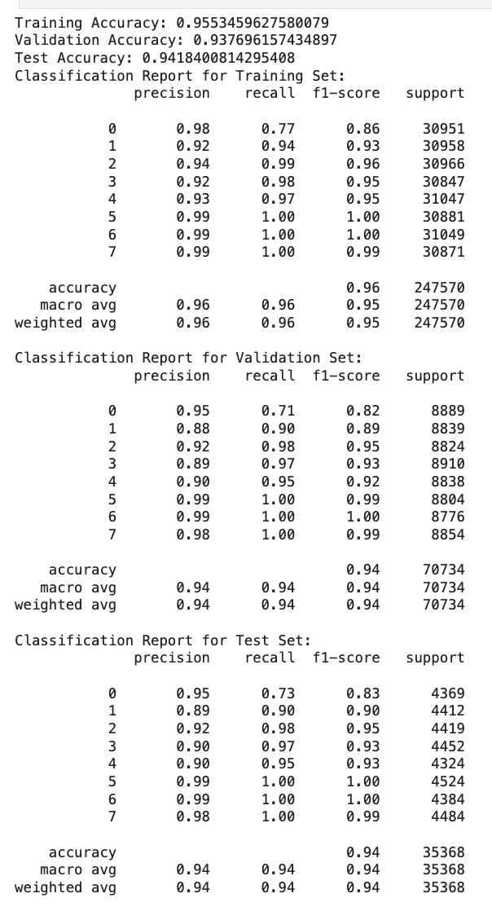

# Group Project for CSE151A

The exploratory data analysis conducted on the mushroom datasets provides insight into the distinguishing and classifying a specific mushroom's habitat. The primary dataset, with 173 observations across 23 features, including cap dimensions, colors, shape, surface, and more, reveals details about biodiversity. It does contain a number of null values which are concentrated in about five features. The secondary dataset expands the scope with thousands of observations for stem dimensions, ring type, and cap shape, alongside other features, and is devoid of null data. We performed introductory visual and statistical analysis, and saw a few patterns emerge, such as the distribution of cap diameters and color variations. These datasets' have the potential to reveal discriminative features critical for distinguishing digestibility. Through careful data preprocessing—including cleaning, normalizing, and feature extraction—we aim to move closer to accurately distinguishing between edible and poisonous mushrooms.

After we removed any Nan values, we alo conducted basic data cleaning such as one-hot encoding of our categorical features and output class. In addition to that, we used Chi-Squared tests and the SelectKBest library to determine the most significant features uin our dataset. In addition to that, we used Random Forests to determine the importance of various features, and from this we were able to determine the most significant features to impact the performance of the model, and to reduce the overall dimensionality of the model. We created multiple distibutions to determine how the classses are associated with the various features, such as seeing the distribution of the cap-shape values by the habitat of the various mushrooms. We also created a correlation matrix between the variosu features, to determine which of them are the most correlated and can affect each other.

We also used SMOTE in oversampling our data points. This is because the the habitats for which the mushrooms were found was not uniform, and over 40,000 of the mushrooms were in the woods. Oversampling resulted in us getting a uniform distribution of the habitats in which the mushrooms were found. After oversampling, the B-cap shape distribution, C-Cap shape distribution, and F-cap shape distribution can be seen below. There were vastly more mushrooms having a stem width of 0 compared to stem width of 1.

----------------------------------------------------------------------------------------
Below is a learning graph that compares the accuracy scores of the training set, the test set, and the cross validation set when using our model as we increase the set size to 35000. The graph shows that the accuracy score of the training set, the cross validation set, and the test set of our model are very close as we continue to increase the set size–in fact just thousandths away. This shows us that there isn't any overfitting. If there was overfitting, the scores would be wildly different. 

Here is the full classification reports for the training set, validation set, and test set.

Below is a confusion matrix of the predicted habitat and the true habitat. Each of the letters corresponds to the following:
- w = waste
- u = urban
- p = paths
- m = meadows
- l = leaves
- h = heaths
- g = grasses
- d = woods

The next two models we are thinking of using on this are random forest classification and k-nearest neighbors. We thought these were the best because random forest classification is likely to output an accurate prediction for classification problems because it uses multiple decision trees with various subsets of the dataset. The problem with random forest classification algoerithms is that they tend to overfit to the training dataset, so we will need to be careful when training our model.  As for k-nearest neighbors, given that all of our habitat labels correspond to a specific group, it will be easy to use a clustering algorithm to classify the various mushrooms. Clustering tends to be a very versatile method for classification and k-nearest neighbors is an efficient clustering algorithm that we can test with various parameters. 

----------------------------------------------------------------------------------------
## Milestone 4: Model 2 (KNN) and Evaluation

After running our second model, K-nearest neighbors, on the data, below are the learning curve, confusion matrix, and classification report. 

From these visuals we can tell that as we increase the training set size, the accuracy of both the training set and the cross validation set increase, surpassing the test score. Overall, when compared to the first model, the accuracy increase amongst all sets. 

The hyperparameter tuning that we did involved using cross-validation with GridSearchCV to test the number of nearest neighbors that yield the highest accuracy. We used values [1,3,5,7,9] for the number of nearest neighbors, and we found that 9 yielded the highest accuracy of 0.74.

Something notable about the hyperparameter tuning is that it resulted in the accuracy scores of our logistic regression model decreasing (as seen below). However, our K-nearest neighbors model was still more accurate than our first model with the initial data used.

When looking at our second model, we decided on continuing with our original plan of using random forest classification to see if we can increase accuracy even further. This is because random forest classification tends to be more accurate than KNN because of its nature as an ensemble model and its generally accurate performance, relative to K-nearest neighbors. 

#### Conclusion: KNN
We are happy with the results with our 2nd model, a K-nearest neighbors model using the 5 nearest neighbors. There was no overfitting, the accuracy score kept increasing with an increased training set size, and it did better than our first model. 

To improve upon this model, we can use further test out different amounts of nearest neighbors and see what value is most optimal by comparing the performance of the model on our test data set after verifying its performance on our training data set. 
